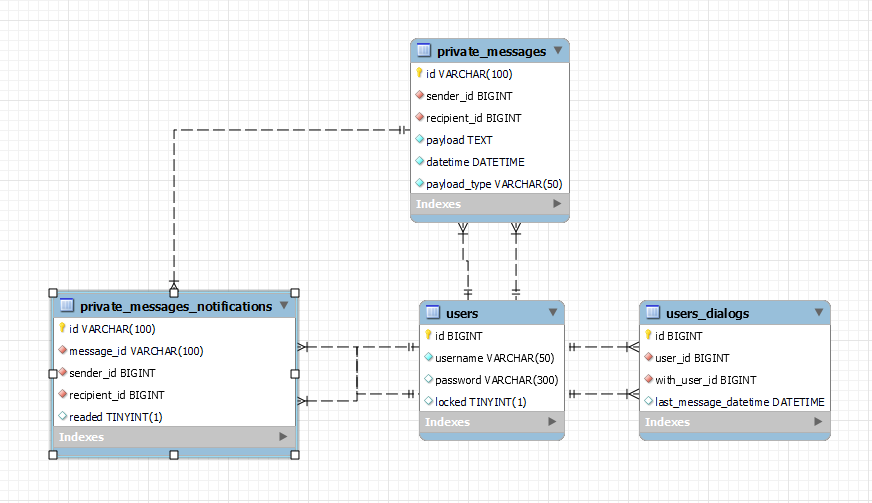

# Chat-Server
Серверная часть чата

#### Стек технологий
* Java
* Spring Boot
* MySQL
* Hibernate

#### Описание возможностей
* Личные сообщения
* Групповые чаты
* Секретные личные чаты с шифрованием end-to-end


#### Доступные роли
* ROLE_USER - простой user
* ROLE_ADMIN - роль администратора. FULL ACCESS


## Архитектура
### Общая схема взаимодействия клиент-сервер
Пользователь отправляет сообщение другому пользователю. Сообщение попадает на сервер. С сервера пользователю отправляется уведомление о новом сообщении.
Предварительная структура:


### Адреса подписок:
* ```/user/{username}/init``` - адрес подписки для получения начальной информации для инициализации клиента. Необходимо просто подписаться,
сообщений отправлять не нужно
* ```/user/{username}/private/messages``` - адрес подписки для получения личных сообщений от других пользователей


### Таблицы в БД



#### USERS
Содержит базовую информацию о пользователе
| Наименование поля | Тип данных |
|:------------------|:----------:|
|userid             |number      |
|username           |varchar     |
|password           |varchar     |
|is_banned          |bool        |

#### USERS_EXTENDED
Содержит дополнительную информацию о пользователе

#### ROLES
Содержит существующие роли
| Наименование поля | Тип данных |
|:------------------|:----------:|
|roleid             |number      |
|rolename           |varchar     |
